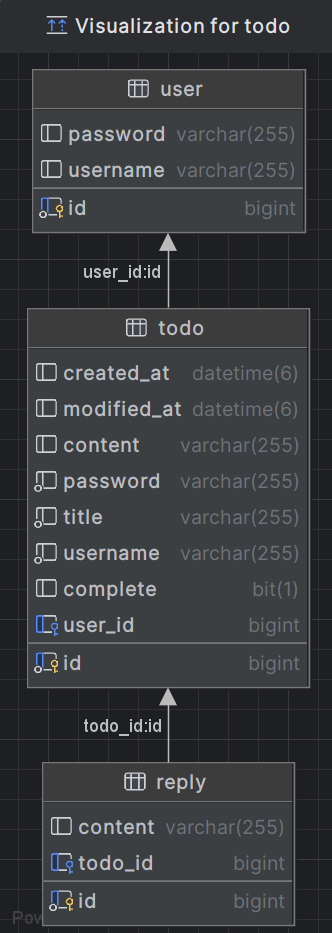

# 투두앱 구현하기 
## 스프링 개인프로젝트 두번째. <br> Todo  application 만들기

## 사용 기술
### 프로그래밍 언어: 	
### 웹 개발:  
### 데이터베이스: 
### 개발 도구: 
### 의존성 관리: 
<br>

## 구현 기능
#### 회원가입 : 사용자는 회원가입하여 사용권한을 얻을 수 있습니다.
#### 로그인  :  회원가입한 정보를 입력하여 CRUD 권한을 사용할 수 있습니다.
#### 투두카드 작성  :  투두카드 (제목, 내용, 작성날짜) 를 작성할 수 있습니다.
#### 투두카드 조회  :  작성된 카드를 조회할 수 있습니다. 
#### 투두카드 리스트 조회 : 등록된 카드 전체 목록을 조회할 수 있습니다.
#### 투두카드 수정
#### 투두카드 완료 기능
#### 댓글 작성
#### 댓글 수정
<br>

## 애플리케이션 실행
#### 1. git clone 
```
git clone https://github.com/dmlal/Todo-app.git
```
#### 2. 브라우저 url 실행

<br><br>
#### ERD


## 프로젝트 

